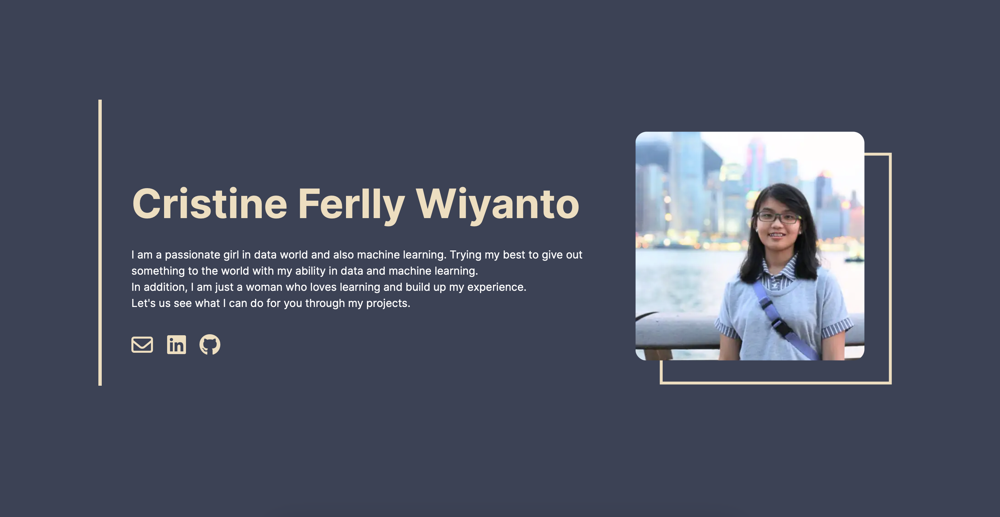

  <a href="https://www.gatsbyjs.com/?utm_source=starter&utm_medium=readme&utm_campaign=minimal-starter">
    <!-- 
  </a> -->

<h1 align="center">
  Welcome to Cristine's Home
</h1>

---

## 👋🏻 Hi everyone!

This is my first time coding my portfolio and IT IS LIVE!! (not like my any other portfolio trials). Also I want to thank you to [Brittany Chiang](https://brittanychiang.com){:target="_blank"} because I get the inspiration from her.

I built this with [Gatsby](https://www.gatsbyjs.com){:target="_blank"}

## Preview
{:target="_blank"}

## Ψ Forking This Repo
**Please read!**
If you guys want to use this code as their own website. I will be open for that. It just that please give me some attribution. 

Why?

Because I spent my time, my effort, many nights just to build this website. Yes, I build it from the beginning like designing my website and then put it in figma and turned it into a website. So please, all you guys need to do just  give me proper credit by linking back to ........ Thanks!

Also note that I did not build this site with the intention of it being a starter theme, so if you have questions about implementation, please refer to the [Gatsby docs](https://www.gatsbyjs.com/docs/).

## 🌊 The Flow
1. **Low Fidelity Prototype**  
   This is the first step I took before I built my website
   

2. **High Fidelity Prototype**  
   Next, I turned the low fidelity into the high fidelity prototype. You can check it on [my Figma](https://www.figma.com/file/JOdP7JVJbU1UwaOkSiZXi3/Website?type=design&node-id=0%3A1&mode=design&t=xl3hzoSBgPBAEhoa-1){:target="_blank"}

3. **Building website**  
   After that, I started to realize the high fidelity into the real website
